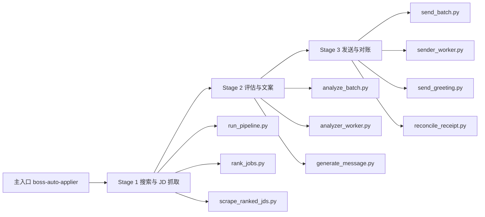

# 项目交接文档

这是一份给新接手同学看的详细说明文档。

它和 `README.md` 的区别是：

- `README.md` 负责快速介绍项目
- 本文档负责讲清楚这套框架为什么这样设计、主链怎么跑、skills 怎么分工、脚本怎么协作、接手后先看什么、出问题去哪里排查

如果你第一次接触这套仓库，先看本文档，再看 `README.md` 和各个 `SKILL.md`。

## 1. 项目是什么

这是一个基于 OpenClaw skills 和本地脚本的 BOSS直聘自动投递框架。

它的目标不是“让模型代替脚本操作页面”，而是把职责拆清楚：

- 脚本负责所有浏览器动作、页面判断、重试、恢复、发送和对账
- 模型只负责读取 `candidate-resume.md`、读取 JD JSON，然后输出结构化判断和打招呼文案

这是这套框架最重要的设计原则，也是后续所有修改必须遵守的原则。

## 2. 为什么这样设计

这套框架不是一个纯 prompt 系统，而是一个“skill 路由 + 脚本执行”的自动化系统。

这样设计的原因很直接：

- BOSS 页面是高风险交互环境，页面跳转、风控、错会话、按钮状态都不稳定
- 如果让模型直接负责点击和恢复，流程会不稳定，也不可测试
- 如果把页面动作沉到脚本里，才能做：
  - 固定输入输出
  - 重试和恢复
  - 统一日志
  - 统一回执
  - 可复现问题定位

所以，这个仓库不是“AI 自动投递 prompt 集”，而是“由技能调度脚本执行的自动投递工作流”。

## 3. 总体架构



更详细的文件映射见：

- `skills/boss-auto-applier/references/workflow-map.md`

## 4. 主设计原则

接手这套仓库时，先记住下面 8 条规则：

1. 浏览器动作只能走脚本，不能靠模型临时补点击
2. 模型不负责重试、不负责切会话、不负责容灾
3. Stage 1 只负责拿到岗位和 JD，不做 fit 判断
4. Stage 2 是唯一允许模型参与业务判断的阶段
5. Stage 3 只负责发送和对账，不改写文案
6. 最终结果一律看 `receipt.json`
7. 风控出现时优先保留已抓数据，不要为了“跑完”破坏状态
8. 新功能如果涉及页面行为，优先加脚本，不要加 prompt

## 5. 仓库结构

```text
.
├── AGENTS.md
├── README.md
├── docs/
│   └── HANDOFF.md
├── candidate-preferences.json
├── candidate-resume.md
├── data/
└── skills/
    ├── boss-auto-applier/
    ├── boss-job-searcher/
    ├── boss-job-analyzer/
    ├── boss-job-sender/
    ├── boss-zhipin-search/
    ├── boss-jd-evaluator/
    ├── boss-greeting-sender/
    └── jd-greeting-generator/
```

目录职责：

- `AGENTS.md`
  - 整个仓库的主入口说明
- `README.md`
  - GitHub 首页的快速说明
- `docs/HANDOFF.md`
  - 给接手者的详细说明
- `candidate-resume.md`
  - 简历模板
- `candidate-preferences.json`
  - 偏好和搜索参数模板
- `data/`
  - 数据目录占位；导出版默认不带真实数据库
- `skills/*/SKILL.md`
  - 技能路由说明
- `skills/*/scripts`
  - 实际执行脚本
- `skills/*/references`
  - 元素、流程、页面语义参考文档

## 6. skill 体系怎么理解

这套仓库是 skill-first 的组织方式。

意思是：

- 用户意图先命中 skill
- skill 决定应该跑哪条阶段链路
- 具体执行交给脚本

### 6.1 主入口 skill

- `skills/boss-auto-applier/SKILL.md`

这是总入口。

用户说下面这些意图时，应该从这里进：

- 投递
- 自动投递
- 批量投递
- 搜索并投递某类岗位

它不会自己实现所有动作，而是负责把流程拆成三个阶段去调用。

### 6.2 Stage 1 skill

- `skills/boss-job-searcher/SKILL.md`

职责：

- 搜索岗位
- 排序
- 抓取 JD

它不负责：

- fit 判断
- 消息生成
- 实际发送

### 6.3 Stage 2 skill

- `skills/boss-job-analyzer/SKILL.md`

职责：

- 读简历
- 读 JD
- 判断 `fit`
- 写 `reasoning`
- 生成 `message`

它不负责：

- 浏览器操作
- 写数据库
- 发送消息

### 6.4 Stage 3 skill

- `skills/boss-job-sender/SKILL.md`

职责：

- 读取 `eval_summary.json`
- 逐岗位发送
- 记录发送结果
- 对账

它不负责：

- 改写文案
- fit 判断

### 6.5 低层 skill

这几个 skill 不是主入口，但负责局部能力：

- `skills/boss-zhipin-search/SKILL.md`
  - 低层搜索 bundle
- `skills/boss-jd-evaluator/SKILL.md`
  - fit-only 判断
- `skills/boss-greeting-sender/SKILL.md`
  - send-only 包装
- `skills/jd-greeting-generator/SKILL.md`
  - JD/简历文案生成 helper

理解方式很简单：

- `boss-auto-applier` 是总路由
- `boss-job-*` 是三阶段主链
- 其他 skill 是低层能力封装

## 7. 主链脚本怎么协作

### 7.1 Stage 1: 搜索、排序、抓 JD

主链脚本：

- `skills/boss-zhipin-search/scripts/run_pipeline.py`
- `skills/boss-zhipin-search/scripts/validate_filters.py`
- `skills/boss-zhipin-search/scripts/scrape_jobs_browser.py`
- `skills/boss-zhipin-search/scripts/summarize_jobs.py`
- `skills/boss-auto-applier/scripts/rank_jobs.py`
- `skills/boss-auto-applier/scripts/scrape_ranked_jds.py`
- `skills/jd-greeting-generator/scripts/scrape_jd.py`

执行顺序：

1. `run_pipeline.py`
   - 校验搜索参数
   - 启动或连接 BOSS Chrome
   - 抓搜索结果
   - 输出 `jobs.json`
2. `rank_jobs.py`
   - 根据简历和偏好对岗位排序
   - 可读取 `boss_greeting.db` 做去重
3. `scrape_ranked_jds.py`
   - 批量打开排序后的职位详情
   - 调用 `scrape_jd.py` 抓取 JD
   - 写 `jd/manifest.json`

Stage 1 成功标志：

- `search/jobs.json` 存在
- `ranked_jobs.json` 存在
- `jd/manifest.json` 存在
- `manifest.scraped > 0`

### 7.2 Stage 2: 评估和文案

主链脚本：

- `skills/boss-auto-applier/scripts/analyze_batch.py`
- `skills/boss-auto-applier/scripts/analyzer_worker.py`
- `skills/boss-auto-applier/scripts/generate_fit_messages.py`
- `skills/jd-greeting-generator/scripts/match_resume.py`
- `skills/jd-greeting-generator/scripts/generate_message.py`

执行逻辑：

1. 读取 `candidate-resume.md`
2. 读取 `jd/manifest.json`
3. 对每个成功抓取的 JD 输出：
   - `fit`
   - `matchScore`
   - `reasoning`
   - `message`
4. 汇总成 `eval_summary.json`

注意：

- `generate_fit_messages.py` 不是完整 Stage 2 主入口
- 它更像一个补文案脚本
- 真正的阶段职责以 `analyze_batch.py` 和 `analyzer_worker.py` 为准

### 7.3 Stage 3: 发送和对账

主链脚本：

- `skills/boss-auto-applier/scripts/send_batch.py`
- `skills/boss-auto-applier/scripts/sender_worker.py`
- `skills/jd-greeting-generator/scripts/send_greeting.py`
- `skills/boss-auto-applier/scripts/reconcile_receipt.py`
- `skills/boss-auto-applier/scripts/self_heal_agent.py`

执行逻辑：

1. `send_batch.py` 读取 `eval_summary.json`
2. 只挑 `fitJobs`
3. 逐岗位调用 `sender_worker.py`
4. `sender_worker.py` 再调用 `send_greeting.py`
5. `send_greeting.py` 负责页面动作、会话校验、发送校验
6. `reconcile_receipt.py` 汇总所有发送结果，生成 `receipt.json`

发送链路的关键特点：

- 不是“点一下按钮就算成功”
- 必须做页面上下文校验
- 必须做发后验证
- 必须对账

## 8. 为什么模型只放在 Stage 2

这是最容易被新人改坏的地方。

原因是：

- Stage 1 和 Stage 3 都直接面对 BOSS 页面
- 这些阶段受页面元素、跳转、登录态、风控、错会话影响很大
- 这些问题适合脚本处理，不适合 prompt 处理

所以模型只能做这些事情：

- 读 JD
- 读简历
- 判断 fit
- 解释 reasoning
- 生成 message

模型不能做这些事情：

- 判断页面该点哪个按钮
- 修复跳错页面
- 切换聊天会话
- 处理发送失败后的恢复
- 判断是否真正发出消息

如果你把上面这些行为重新放回模型，稳定性会明显下降。

## 9. BOSS 页面元素为什么单独成文档

这套仓库不是靠截图记忆页面，而是把页面语义拆成参考文档。

原因：

- 页面会变
- 选择器可能变
- 但页面语义相对稳定

### 9.1 搜索页参考

看这里：

- `skills/boss-zhipin-search/references/boss-search-elements.md`

它说明了：

- 搜索输入框怎么识别
- 结果页容器怎么识别
- 岗位卡片怎么识别
- 为什么翻页不用 UI，而用 `&page=N`
- 什么情况算验证页或风控页

### 9.2 聊天页参考

看这里：

- `skills/jd-greeting-generator/references/boss-chat-elements.md`

它说明了：

- 职位详情页和聊天页的 URL 语义
- `立即沟通`、`打招呼`、`继续沟通` 分别代表什么状态
- popup 里的 `继续沟通` 为什么重要
- `#chat-input` 为什么是优先输入框
- 什么叫“错会话”
- 什么叫“发后验证”

这两个参考文件是新人理解脚本行为的最快入口。

## 10. 运行前要准备什么

### 10.1 环境依赖

你至少需要：

- macOS 或 Linux
- `python3`
- `curl`
- Google Chrome 或 Chromium
- `agent-browser`
- 一个已经登录 BOSS直聘 的 Chrome profile

### 10.2 浏览器约定

这套仓库默认使用：

- Chrome CDP 端口 `18801`

辅助脚本：

- `skills/jd-greeting-generator/scripts/start_boss_chrome.sh`
- `skills/jd-greeting-generator/scripts/ab_boss.sh`

这两个脚本的作用：

- `start_boss_chrome.sh`
  - 拉起或连接专用 Chrome
- `ab_boss.sh`
  - 强制 `agent-browser` 连接到 BOSS 的 CDP 端口，而不是临时开新隔离 session

这件事非常关键，因为：

- 新隔离 session 没有登录态
- 没有登录态就无法稳定抓 JD 和发送

### 10.3 模板文件

首次接手时，先编辑：

- `candidate-resume.md`
- `candidate-preferences.json`

`candidate-resume.md` 负责提供：

- 个人背景
- 技能栈
- 项目经历
- 优势和边界

`candidate-preferences.json` 负责提供：

- 城市
- 搜索关键词
- 薪资代码
- 经验代码
- 学历代码
- 职位类型代码
- 公司规模代码

## 11. 第一次跑通应该怎么做

建议顺序不要跳。

### 11.1 第一步，只验证浏览器

先启动 Chrome：

```bash
bash skills/jd-greeting-generator/scripts/start_boss_chrome.sh
```

然后确认 `18801` 能连接。

如果这一步不通，后面都不要继续。

### 11.2 第二步，只跑搜索

```bash
python3 skills/boss-zhipin-search/scripts/run_pipeline.py \
  --input skills/boss-zhipin-search/templates/input.example.json \
  --outdir .openclaw-runs/demo-search \
  --cdp-port 18801 \
  --headed
```

这一步主要看：

- 能不能进入搜索结果页
- 能不能抓到岗位卡片
- 能不能输出 `jobs.json`

### 11.3 第三步，跑完整链路但不发送

```bash
python3 skills/boss-auto-applier/scripts/orchestrate_apply.py \
  --run-dir .openclaw-runs/boss-apply/demo-dryrun \
  --keyword "AI产品经理" \
  --city "深圳" \
  --max-apply 5 \
  --cdp-port 18801 \
  --dry-run
```

这一步主要看：

- Stage 1 能不能拿到 `jd/manifest.json`
- Stage 2 能不能生成 `eval_summary.json`

如果 dry run 都跑不通，不要直接测发送。

### 11.4 第四步，完整发送

```bash
python3 skills/boss-auto-applier/scripts/orchestrate_apply.py \
  --run-dir .openclaw-runs/boss-apply/demo-live \
  --keyword "AI产品经理" \
  --city "深圳" \
  --max-apply 5 \
  --cdp-port 18801 \
  --selection-mode broadcast
```

第一次发送建议：

- 小批量
- 有人盯着页面
- 先看回执，再扩大规模

## 12. `orchestrate_apply.py` 是什么角色

很多新人会误会这个文件。

- `skills/boss-auto-applier/scripts/orchestrate_apply.py`

它的角色是：

- 一个完整 CLI 编排器
- 一个可直接跑通三阶段的入口
- 一个调试和验证主链的测试入口

它不是说“只有它才能代表产品接口”。

在 OpenClaw 里，主入口仍然是：

- `skills/boss-auto-applier/SKILL.md`

CLI 编排器和 skill 路由的关系是：

- skill 决定该走哪条能力链
- orchestrator 决定如何一次性把整条链跑完

## 13. 运行过程中会产生哪些文件

一次标准运行通常会产生下面这些文件：

- `search/jobs.json`
- `search/results.json`
- `search/summary.md`
- `ranked_jobs.json`
- `jd/*.json`
- `jd/manifest.json`
- `eval/<jobId>.json`
- `eval_summary.json`
- `send/<jobId>.json`
- `logs/stage3_send.jsonl`
- `receipt.json`

你应该怎么理解它们：

- `jobs.json`
  - 搜索原始结果
- `ranked_jobs.json`
  - 排序后的候选岗位
- `jd/manifest.json`
  - 哪些 JD 抓到了，哪些没抓到
- `eval/<jobId>.json`
  - 单岗位评估结果
- `eval_summary.json`
  - Stage 2 汇总结果
- `send/<jobId>.json`
  - 单岗位发送结果
- `logs/stage3_send.jsonl`
  - Stage 3 行为日志
- `receipt.json`
  - 最终运行回执

如果只看一个文件，请优先看：

- `receipt.json`

## 14. 怎么判断一轮运行是否成功

判断顺序如下：

1. 看 `receipt.json` 是否存在
2. 看 `receipt.json` 的统计是否合理
3. 再看 `send/*.json` 的单岗位结果
4. 最后看 `logs/stage3_send.jsonl` 定位细节

不要反过来。

因为：

- 单岗位日志可能有中间态
- 对账后才是最终统计

## 15. `boss_greeting.db` 是什么

这个仓库导出版没有带真实数据库，但代码默认仍然支持：

- `data/boss_greeting.db`

它主要用于：

- 去重
- 记录发送状态
- 缓存部分 JD / greeting 信息

当前行为要点：

- `rank_jobs.py` 会尝试读取这个库做去重
- `send_greeting.py` 会在运行时初始化数据库和表结构
- 相关 schema 在：
  - `skills/jd-greeting-generator/scripts/schema.sql`

所以导出版 `data/` 是空的并不代表不能运行。

真正运行时，数据库会逐步创建和填充。

## 16. 风控和稳定性是怎么处理的

这套仓库不是追求“最快”，而是追求“可恢复、可定位、可控”。

核心策略：

- 搜索页尽量少点 UI
- 翻页用 URL 参数
- 抓 JD 前后有节奏控制
- 发送前要做页面预检查
- 发送后要做成功校验
- 错会话时优先纠偏
- 遇到验证页时保留已抓结果并停下来

一句话总结：

- 宁可慢一点，也不要把状态跑乱

## 17. OpenClaw 应该怎么调用这套仓库

推荐顺序：

1. 主 agent 命中 `skills/boss-auto-applier/SKILL.md`
2. 按 Stage 1 -> Stage 2 -> Stage 3 依次调用子 skill
3. 模型在 Stage 2 输出结构化评估和文案
4. Stage 1 和 Stage 3 的所有页面动作全部交给脚本

如果只做局部能力，可以单独使用：

- 搜索
  - `boss-zhipin-search`
- fit 判断
  - `boss-jd-evaluator`
- 文案生成
  - `jd-greeting-generator`
- 发送
  - `boss-greeting-sender`

但在完整投递场景里，仍然应以三阶段主链为准。

## 18. 哪些文件是主链，哪些是历史或辅助

### 18.1 主链优先看

- `AGENTS.md`
- `README.md`
- `docs/HANDOFF.md`
- `skills/boss-auto-applier/SKILL.md`
- `skills/boss-job-searcher/SKILL.md`
- `skills/boss-job-analyzer/SKILL.md`
- `skills/boss-job-sender/SKILL.md`
- `skills/boss-auto-applier/references/workflow-map.md`

主链脚本：

- `skills/boss-zhipin-search/scripts/run_pipeline.py`
- `skills/boss-auto-applier/scripts/orchestrate_apply.py`
- `skills/boss-auto-applier/scripts/analyze_batch.py`
- `skills/boss-auto-applier/scripts/send_batch.py`
- `skills/jd-greeting-generator/scripts/send_greeting.py`

### 18.2 辅助或局部能力

- `skills/boss-jd-evaluator/SKILL.md`
- `skills/boss-greeting-sender/SKILL.md`
- `skills/jd-greeting-generator/SKILL.md`
- `skills/boss-zhipin-search/references/boss-search-elements.md`
- `skills/jd-greeting-generator/references/boss-chat-elements.md`

### 18.3 旧链路或调试入口

- `skills/jd-greeting-generator/scripts/run_greeting_pipeline.py`
- `skills/boss-auto-applier/scripts/generate_fit_messages.py`

这些文件不是完全无用，但不是现在的标准总链路入口。

新人不要先从这里理解系统。

## 19. 接手后推荐阅读顺序

建议按这个顺序看：

1. `README.md`
2. `docs/HANDOFF.md`
3. `AGENTS.md`
4. `skills/boss-auto-applier/SKILL.md`
5. `skills/boss-auto-applier/references/workflow-map.md`
6. `skills/boss-job-searcher/SKILL.md`
7. `skills/boss-job-analyzer/SKILL.md`
8. `skills/boss-job-sender/SKILL.md`
9. `skills/boss-zhipin-search/references/boss-search-elements.md`
10. `skills/jd-greeting-generator/references/boss-chat-elements.md`
11. 再读对应脚本

如果一上来就看 `send_greeting.py`，很容易陷入局部细节，反而搞不清整条链。

## 20. 常见误区

### 误区 1

“模型很强，所以可以让模型自己处理页面逻辑。”

结论：

- 不行

原因：

- 页面逻辑不稳定
- 不可复现
- 不可对账

### 误区 2

“Stage 2 也可以顺手发消息。”

结论：

- 不行

原因：

- 这会打破阶段边界
- 无法做统一发送日志和回执

### 误区 3

“只要单条 `send/*.json` 说成功了，就算整轮成功。”

结论：

- 不对

原因：

- 最终统计以 `receipt.json` 为准

### 误区 4

“`run_greeting_pipeline.py` 看起来简单，先从它改起。”

结论：

- 不建议

原因：

- 它更偏历史调试链路，不是当前标准主链入口

## 21. 新人第一次改代码，应该改哪里

按改动类型划分：

如果你要改搜索逻辑，先看：

- `skills/boss-zhipin-search/scripts/scrape_jobs_browser.py`
- `skills/boss-zhipin-search/references/boss-search-elements.md`

如果你要改排序或筛选逻辑，先看：

- `skills/boss-auto-applier/scripts/rank_jobs.py`
- `candidate-preferences.json`

如果你要改 fit 判断或文案逻辑，先看：

- `skills/boss-auto-applier/scripts/analyze_batch.py`
- `skills/boss-auto-applier/scripts/analyzer_worker.py`
- `skills/jd-greeting-generator/scripts/generate_message.py`

如果你要改发送稳定性，先看：

- `skills/boss-auto-applier/scripts/send_batch.py`
- `skills/boss-auto-applier/scripts/sender_worker.py`
- `skills/jd-greeting-generator/scripts/send_greeting.py`
- `skills/jd-greeting-generator/references/boss-chat-elements.md`

如果你要改结果统计，先看：

- `skills/boss-auto-applier/scripts/reconcile_receipt.py`

## 22. 发布到 GitHub 前要注意什么

这份导出版已经做过一轮裁剪，但发布前仍然建议再检查一次：

- 不要提交真实简历
- 不要提交真实偏好配置
- 不要提交真实数据库
- 不要提交历史运行产物
- 不要提交浏览器 profile
- 不要提交本机绝对路径
- 不要提交编辑器交换文件或缓存文件

尤其要注意这类文件：

- `.swp`
- `.DS_Store`
- 历史截图
- 实际投递回执
- 本地日志

## 23. 接手后的最小目标

如果你是第一次接手，不要一上来追求改功能。

先完成这三个目标：

1. 能独立解释 Stage 1 / 2 / 3 的职责边界
2. 能独立跑通搜索和 dry run
3. 能根据 `receipt.json`、`stage3_send.jsonl` 定位一轮发送问题

做到这三点，才算真正接手成功。

## 24. 一句话总结

这套仓库的核心不是“让模型自动投简历”，而是：

- 用 skill 路由明确阶段边界
- 用脚本承接所有不稳定页面逻辑
- 用模型只做可结构化、可约束的 JD 评估和文案生成
- 用回执和日志保证整条链路可排查、可维护

如果后续要继续扩展，仍然要遵守这条主线。
